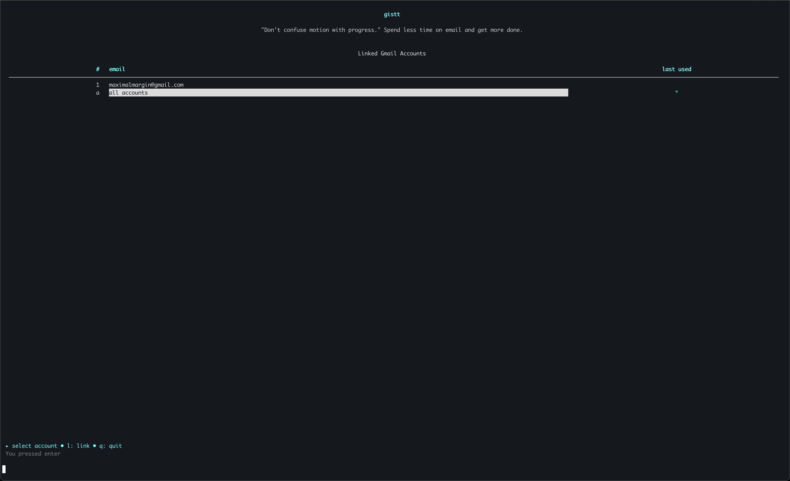

# gistt

> "Don't confuse motion with progress." Spend less time on email and get more done.

gistt is a terminal-native AI email client that shows you the gist — so you can focus on real progress.



## Why gistt?

Email is broken. Subject lines were supposed to tell you what a message is about, but in a world of promotions they're designed to make you click rather than inform. We haven't rethought the function of email in a while.

gistt is built around three core principles:

1. **Gist-focused, not email-focused** — We show you the gist, not the inbox.
2. **Terminal constraint as a feature** — Minimal UI, forced simplification.
3. **Action-focused state machine** — Get you out as fast as possible (disengagement as success).

## Quick start

### Install via Homebrew (beta)

```bash
brew tap maximalmargin/gistt https://github.com/maximalmargin/gistt-tap
brew install gistt
```

### Prerequisites

- Python 3.10+
- Gmail account
- Google Cloud project with Gmail API enabled
- Gemini API key

### 1. Google Cloud & Gmail API

Enable the Gmail API in your Google Cloud project and download the OAuth client JSON.

- Set desktop app.
- Add the accounts you want to link to `APIs & Services → OAuth consent screen → Test users`.

### 2. Place credentials

Place the file at `~/.config/gistt/client_secret.json`.

Set the `GISTT_CLIENT_CREDENTIALS` environment variable to override if you prefer a different location.

### 3. Authenticate

Run `gistt` once to complete the OAuth flow.

By default tokens are written to `~/.local/share/gistt/accounts/<email>/token.json`.

**To unlink an account**: Remove the account's folder under `~/.local/share/gistt/accounts/<email>/`.

### 4. Configure Gemini

Set the Gemini API key in your environment (e.g. `.env`):

```bash
Get your key from https://aistudio.google.com/apikey
export GEMINI_API_KEY="YOUR_API_KEY"
```
**Note**: The CLI stores persisted state under `~/.local/share/gistt`. Remove that directory if you need a clean slate.

## Usage

After installing via Homebrew, launch the client from any terminal:

```bash
gistt
```

When working from a source checkout, run `python -m gistt.ui.cli` for the same experience.

**Keyboard shortcuts**:

- `g` — Fetch new gists
- `tab` — Execute recommended action
- `s` — Mark as read
- `e` — Archive
- `r` — Draft reply
- `j/k` — Navigate
- `h` — Toggle filter
- `q` — Quit

## Design notes

- **UI surface** lives in the Rich-based CLI (`src/gistt/ui/*`). Views translate domain objects into layout primitives, own key handling, and never touch persistence or network APIs directly.
- **Gmail domain** owns account management, OAuth, thread fetching, and label mutations. The pieces live under `src/gistt/services/gmail_accounts.py` and `src/gistt/services/gmail_ops.py`.
- **Gist domain** centers on models, settings, and cached results. `GistProducer` coordinates GenAI calls, while `GistCacheStore` persists summaries and states.
- **GenAI integration** (Gemini today) turns email threads into `ActionGroupRec` plus summary text through `GistProducer`, which wraps `GenAIOps`.
- **Cross-cutting utilities** sit at the edges and depend only on public interfaces, keeping each domain replaceable.

## Contributing

gistt is early-stage and designed to be hackable. We're looking for tinkerers to help shape it. Here are features we'd love your help with:

- Smoothing out the UI/UX
- Hit `u` to unsubscribe from mailing lists
- Slash commands for power users
- More AI model backends

Email maximalmargin@gmail.com to ask about contribution. PRs welcome.

## Artifact Preview

[View the interactive artifact](https://htmlpreview.github.io/?https://raw.githubusercontent.com/maximalmargin/gistt-tap/main/media/artifact.html)


